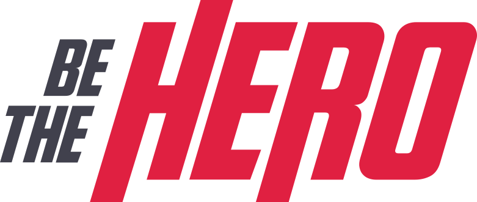

<h1 align="center">
    
</h1>

<h2 align="center"> Aplicação para conectar ONGs ou pessoas que desejam ajudar... </h2>

<h3 align="center"> 
Criada com a stack  React, 
   React Native, 
    Node e 
    SQLite </h3>

 
   

# Semana OmniStack 11.0
#### [RocketSeat.com.br](https://rocketseat.com.br/)

O Be The Hero é o projeto da semana OmniStack 11.0 da Rocket Seat, com o objetivo de construir um aplicativo para o contato de ONG's com doadores.

## Instalação 

Para executar esse repositório baixe-o para sua maquina ou de um `Git Clone`

### Backend 

- abra a pasta `Hero/backend/` com CMD ou Shell do windows e rode os comandos abaixo.
- `$ npm install` esse comando ira instalar todos os módulos necessários ao Node.JS
- `$ npm start` Ira iniciar o servidor backend na `localhost:3333\` 

### Frontend | Web

- abra a pasta `Hero/frontend/` com CMD ou Shell do windows e rode os comandos abaixo. 
- `$ npm install` esse comando ira instalar todos os módulos necessários ao React
- `$ npm start` Ira iniciar o servidor Frontend na `localhost:3000\` 

### Mobile 

- abra a pasta `Hero/mobile/` com CMD ou Shell do windows e rode os comandos abaixo.
- `$ npm install` esse comando ira instalar todos os módulos necessários ao React Native
- `$ npm start` Ira iniciar o servidor  de desenvolvimento do Expo 
